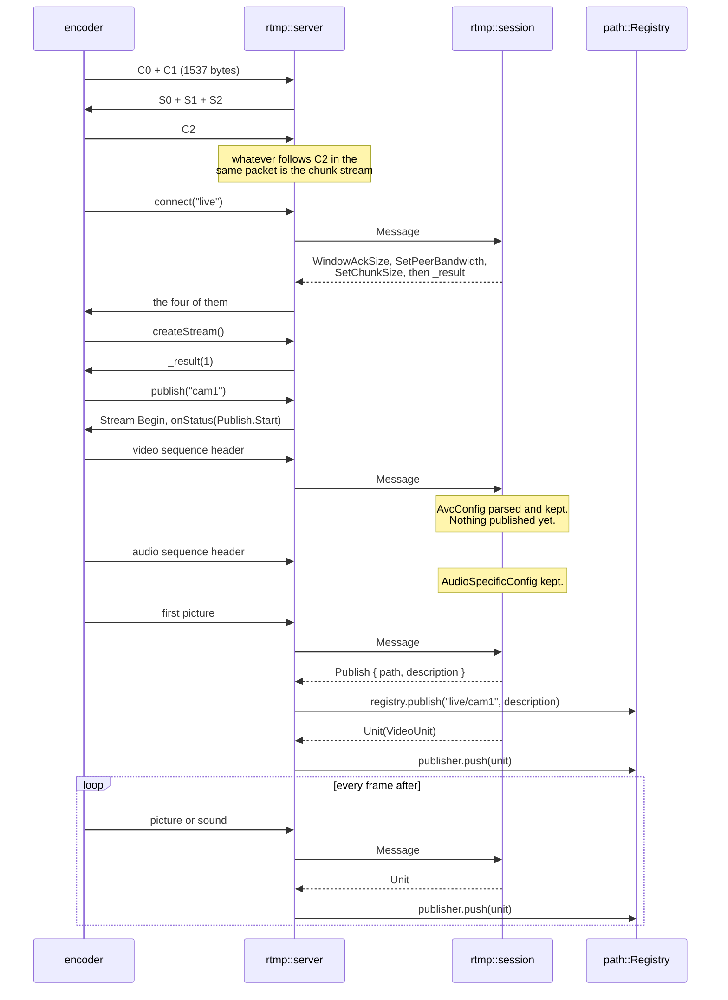
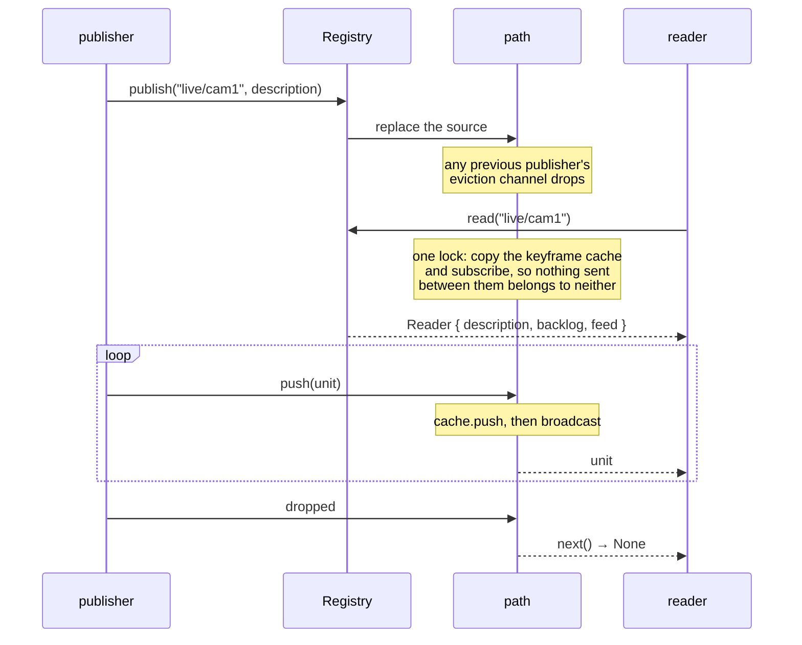

# How relaybay works

What is built, and how a byte gets from an encoder to a player. The README
says what the project is for; this says what the code does.

Current as of `349d415`. 237 tests (235 unit, 2 doc).

## The layers

```
                       ┌─────────────────────────────────────────┐
   no runtime          │ codec::h264   codec::aac                │
   fed a buffer,       │ track  unit                             │
   asked what it       │ rtmp::{handshake, chunk, amf0, flv,     │
   makes of it         │        session}                         │
                       │ rtp::{h264, aac}                        │
                       │ rtsp::{message, sdp, session}           │
                       └─────────────────────────────────────────┘
   ─────────────────────────── the boundary ──────────────────────
                       ┌─────────────────────────────────────────┐
   tokio               │ path                                    │
   sockets, channels,  │ rtmp::server   rtsp::server             │
   timers              │ server                                  │
                       └─────────────────────────────────────────┘
```

Nothing above the line does I/O, spawns anything or waits for anything. A
whole RTMP publish and a whole RTSP play are driven in tests with no runtime
at all, and that is what lets `Server::start` keep a runtime inside itself so
an application on ordinary threads never sees one.

## What is built

| Module | Does | Tests |
| ------ | ---- | ----- |
| `codec::h264` | Annex-B and length-prefixed framing both ways, `AVCDecoderConfigurationRecord`, parameter sets | 18 |
| `codec::aac` | `AudioSpecificConfig`: object type, sample rate, channels, and the bytes kept verbatim | 10 |
| `track` | `Description`, `Track`, `TrackId`, `Codec` | 8 |
| `unit` | `Unit`, `VideoUnit`, `AudioUnit`, payloads | 3 |
| `rtmp::handshake` | C0/C1 → S0/S1/S2 → C2 | 10 |
| `rtmp::chunk` | Chunks ↔ messages, four header formats, extended timestamps | 22 |
| `rtmp::amf0` | The values a command is made of | 17 |
| `rtmp::flv` | The tag body in front of the coded bytes | 13 |
| `rtmp::session` | `connect`, `createStream`, `publish`, and media → units | 25 |
| `path` | Registry, fan-out, keyframe cache, publisher takeover | 14 |
| `rtp` | RTP headers and one stream's numbering | 8 |
| `rtp::h264` | Single NAL unit packets and FU-A fragments | 10 |
| `rtp::aac` | `AAC-hbr` AU headers, and fragmenting | 5 |
| `rtsp::message` | Requests, responses, interleaved frames, `Transport` | 22 |
| `rtsp::sdp` | `Description` → SDP | 10 |
| `rtsp::session` | `OPTIONS`, `DESCRIBE`, `SETUP`, `PLAY`, `PAUSE`, `TEARDOWN` | 20 |
| `rtmp::server` | The socket under a publish | 5 |
| `rtsp::server` | The socket under a play | 11 |
| `server` | `Server::start`, `start_on`, `ServerHandle` | 4 |

## The shape of a session

Both protocols are driven the same way, and it is worth seeing once because
everything else is a detail of it:

```
   socket ──bytes──▶ buffer ──▶ a reader ──messages──▶ a session
                                                          │
                        ◀────────── actions ──────────────┘
                        │
   write a reply ───────┤
   publish / attach ────┤
   push / send a unit ──┘
```

The reader consumes only whole things and leaves the rest, so a caller reads
into the same buffer and asks again. The session holds no socket: it is given
a message and returns a list of what to do. The driver is the only part that
knows a socket exists.

## Publishing over RTMP



### Why the description waits for a frame

A publisher states its tracks one sequence header at a time and never says
how many there will be. Waiting for both would hang on a stream with no
sound; settling at the first would give a silent description to a stream
about to send some. By the time a frame arrives every header it needs has
been sent, because a decoder could not read the frame otherwise.

### Inside one video message

```
RTMP message payload
  └─ flv::read_video
       ├─ SequenceHeader → h264::AvcConfig::parse
       │    ├─ parameters ──────────────▶ track::Codec::H264   (the description)
       │    └─ nal_length_size ─────────▶ kept on the connection
       └─ Picture { keyframe, composition_time, data }
            └─ h264::split_length_prefixed(data, nal_length_size)
                 └─ Vec<Nal> ───────────▶ VideoPayload::H264
```

`nal_length_size` never reaches the description. It is a fact about how RTMP
framed the payload, not about the stream, and an egress that frames some
other way has no use for it.

### Timestamps

RTMP counts 32-bit milliseconds from an origin the publisher never states, so
the first message seen becomes the origin and the counter wrapping after 49
days does not send the stream back to the beginning. A picture's presentation
time is its decode time plus a **signed** 24-bit composition offset — read as
unsigned, a stream with B-frames puts `-1` four and a half hours in the
future.

## The path



- **One publisher, any number of readers.** A second publisher on a name
  displaces the first, which learns of it by waiting on a channel rather than
  by trying to push — an encoder that is reconnecting has usually gone quiet,
  so noticing at the next push would mean never noticing.
- **A publisher is never made to wait.** `push` does not block and cannot
  fail. A live encoder has nowhere to put a picture it is not allowed to
  send, so pushing back does not slow a broadcast down; it breaks it.
- **A reader that falls behind loses everything up to the next picture it can
  start at**, not the oldest units. Dropping one picture out of the middle of
  a group leaves the rest referring to something the reader never got, which
  decodes into smears rather than into nothing.
- **A reader that joins gets the units since the last keyframe**, so it has
  something to decode at once instead of a black screen until the next one.

`Unit::is_keyframe` and `Unit::opens_a_stream` are different questions. Sound
is always the first and never the second: cutting a queue at a frame of sound
would leave the pictures before it, which nothing can decode.

## Playing over RTSP

```mermaid
sequenceDiagram
    participant C as player
    participant D as rtsp::server
    participant S as rtsp::session
    participant P as path::Registry

    C->>D: OPTIONS *
    D->>C: 200, Public: …

    C->>D: DESCRIBE rtsp://h/live/cam1
    D->>S: Request
    S->>P: registry.describe("live/cam1")
    P-->>S: Arc<Description>
    S-->>D: 200 + SDP + Content-Base
    D->>C: the SDP

    C->>D: SETUP …/trackID=0, Transport: RTP/AVP/TCP;interleaved=0-1
    D->>C: 200, Session: …, Transport: …
    C->>D: SETUP …/trackID=1, interleaved=2-3
    D->>C: 200

    C->>D: PLAY rtsp://h/live/cam1
    D->>C: 200
    Note over D: the answer first, then attach:<br/>a packet before it is discarded
    D->>P: registry.read("live/cam1")
    P-->>D: Reader

    loop
        P-->>D: Unit
        Note over D: packetize, then wrap each<br/>packet in $ channel length
        D->>C: interleaved RTP
    end

    C->>D: TEARDOWN
    D->>C: 200, then close
```

### One loop, two things to wait for

Once a client has said `PLAY`, the connection is waiting for whatever the
client says next *and* for the next unit of the stream. That is the shape the
whole protocol is built around, and it is one `select!`:

```rust
tokio::select! {
    read = read(&mut stream, &mut buf) => { /* another request */ }
    unit = next(playing.as_mut()) => { /* packets to write */ }
}
```

### A unit becomes packets

```
Unit::Video(VideoUnit)
  └─ VideoPayload::H264(Vec<Nal>)
       └─ rtp::h264::Packetizer
            ├─ fits the MTU  → one packet, the NAL unit unchanged
            └─ does not      → FU-A, two bytes in front of each piece
                                (the original header byte is not sent;
                                 it is rebuilt from those two)
       └─ message::interleave → $ <channel> <length:16> <packet>

Unit::Audio(AudioUnit)
  └─ AudioPayload::Aac(Bytes)
       └─ rtp::aac::Packetizer
            └─ | AU-headers-length :16 | size :13 | index :3 | frame |
```

Every packet of one access unit carries the same timestamp, and only the last
carries the marker. Timestamps do not start at zero and no two streams agree
about where they did.

### What SETUP settles

The SDP's addresses and ports are all zero on purpose. Where the packets go
is decided per track by `SETUP`, after the client has read the description —
an address in the SDP could only be a second answer to a question asked
somewhere else.

A client that will only take packets over UDP is answered `461 Unsupported
Transport` and asks again for the interleaved form, which is what ffmpeg and
VLC both do. Whether a transport can be provided is a fact about the server,
so the session is told rather than guessing: agreeing to one nothing then
sends over would leave a client waiting for packets that never come.

## Starting and stopping

```rust
let server = relaybay::server::Server::start(Config::default())?;
// … the application's own threads run as they always did …
server.shutdown();
```

`start` builds a runtime and keeps it inside the handle. `start_on` takes one
that already exists, so a host with its own tokio does not end up with two
sets of worker threads. Both bind with the standard library and hand the
socket over, so a port already in use is an error at the call that caused it,
and `start_on` can be called from inside the runtime it is given.

The runtime needs **both I/O and timers**. Writes have deadlines, and a
runtime without timers panics at the first one rather than at startup.

Listeners own the connections they accepted, so ending a listener ends them
too, and shutting down is a matter of dropping one handle.

## Paths

A path is created by whoever publishes to it. RTMP's `connect` gives the app
and `publish` gives the stream key:

```
connect("live") + publish("cam1")   →   live/cam1
```

```
rtmp://host:1935/live/cam1   ──▶  live/cam1  ──▶  rtsp://host:8554/live/cam1
rtmp://host:1935/live/cam2   ──▶  live/cam2  ──▶  rtsp://host:8554/live/cam2
rtmp://host:1935/studio/a    ──▶  studio/a   ──▶  rtsp://host:8554/studio/a
```

There is no limit on how many. A stream key's query string is dropped — that
is where an encoder puts a token, and leaving it in would file the stream
under a name no reader thinks to look for.

## What each layer refuses

Malformed input is refused rather than worked around, because a connection
that is out of step does not come back into it.

| Layer | Refuses |
| ----- | ------- |
| `rtmp::chunk` | A chunk stream opened with an inherited header; a message begun before the last finished; more than 64 chunk streams; a message over 8 MiB |
| `rtmp::amf0` | Any type marker it does not know — the marker is what says how long the value is, so there is nothing to skip |
| `rtmp::flv` | Codecs it does not read, by name; enhanced RTMP, with the FourCC it asked for |
| `rtmp::session` | Media before `publish`; a frame before the sequence header that describes it; a second sequence header that says something else |
| `rtsp::message` | Bytes that are neither a request nor a frame |
| `path` | Nothing — it drops instead, on the reader's side |

The one place unknown input is passed through is `codec::h264`, which keeps
NAL units it does not recognize. A NAL unit's length comes from whatever
framed it, so an unrecognized one can be handed on whole; an AMF0 value's
length comes from its own marker, so an unrecognized one is a value of
unknown length. That is the difference, and it is why the two look
inconsistent and are not.

## Numbers

| | | Why |
| --- | --- | --- |
| `chunk::DEFAULT_CHUNK_SIZE` | 128 | What RTMP opens at, before either peer says otherwise |
| `session::CHUNK_SIZE` | 64 KiB | What this announces, so a header does not cost one per 128 bytes |
| `chunk::MAX_ASSEMBLED_LENGTH` | 8 MiB | Well past a keyframe at any bitrate anybody sends |
| `chunk::MAX_CHUNK_STREAMS` | 64 | An encoder uses a handful; the id space runs to 65 599 |
| `session::WINDOW_SIZE` | 2 500 000 | How many bytes between acknowledgements |
| `amf0::MAX_DEPTH` | 32 | Reading is recursive; RTMP's own messages go two deep |
| `path::BACKLOG` | 1024 units | Several seconds at any ordinary frame rate |
| `path::CACHE_LIMIT` | 8 MiB | A cap on one group of pictures, not a target |
| `rtp::MTU` | 1400 | Under an Ethernet frame, with room for the headers below |
| `rtsp::server::WRITE_TIMEOUT` | 10 s | After which a client is taken to have stopped reading |

## Checking it against real software

Tests written against this crate's own code can be self-consistently wrong.
Two examples put ffmpeg on the far side:

```
cargo run --example live     # ffmpeg publishes; the units are read in process
cargo run --example relay    # ffmpeg → RTMP → relaybay → RTSP → ffmpeg → a file
```

`relay` found a bug 235 passing unit tests did not: the runtime `Server::start`
built had only I/O enabled, and the write deadline needs timers, so the first
slow write panicked. Every `#[tokio::test]` passed, because the test runtime
enables both.

## Not built yet

- **RTSP over UDP.** Clients are answered `461` and retry with the
  interleaved form; most do, and one that does not cannot play.
- **RTCP sender reports.** Audio and video can drift apart over a long
  stream without them.
- **WebRTC and HLS egress.**
- **RTMP egress**, in either direction: serving a player, or publishing out
  to another server.
- **Configuration, authentication, a control API, recording.** Every path is
  created by whoever publishes to it, and anyone may.
